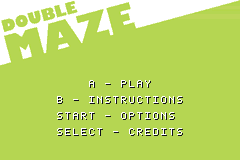
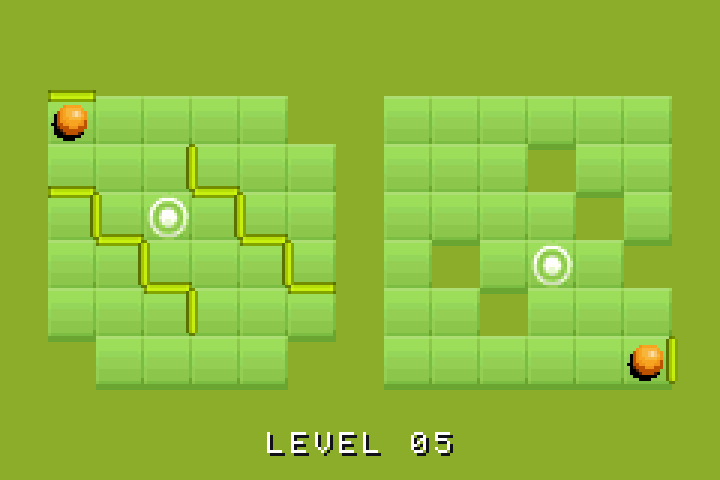
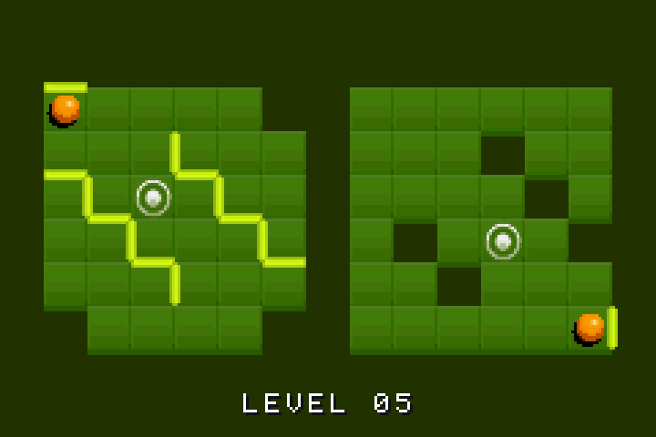
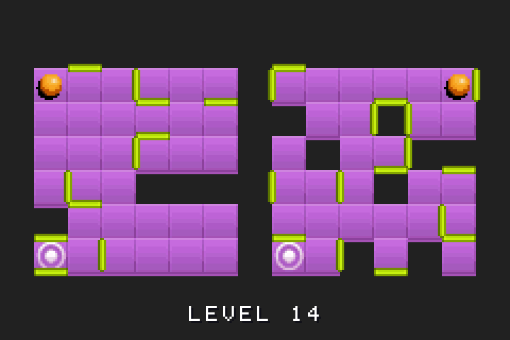
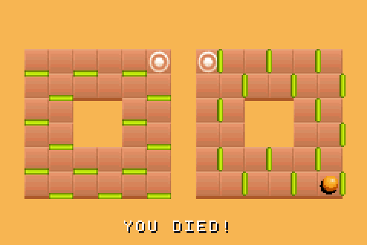
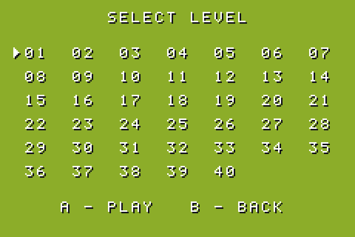
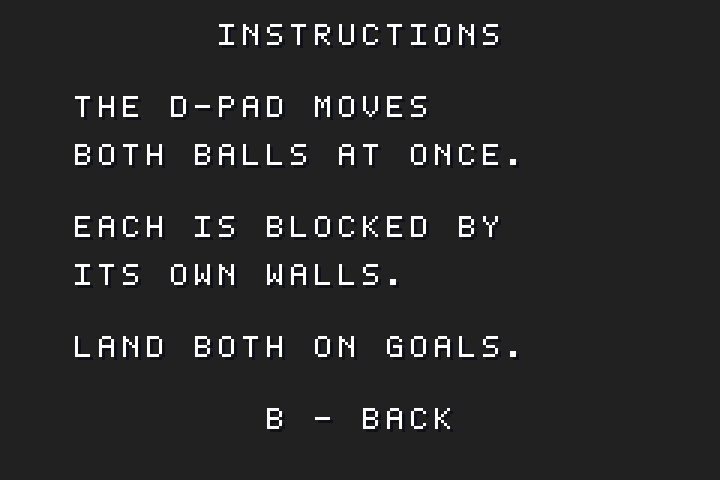

# Double Maze

Game Boy Advance port of the iOS game. Two balls share one 15x8 grid — the left
plays columns 1-6, the right columns 8-13. Every D-pad press moves **both**
balls in that direction, and each is blocked independently by the walls on its
own tile edges. Land on a hole and the level restarts; get both balls onto goal
tiles at the same time and you advance.

40 levels, carried over from the original along with its artwork
(level 35 re-authored -- see below). See
[EXTRACTION.md](EXTRACTION.md) for how the rules and assets were recovered.



| | |
|---|---|
|  |  |
|  |  |
|  |  |

The three tile skins cycle every two levels, as they do in the original. All
screenshots are captured from the running ROM by `tools/grab_screen.py`.

The two images on the top row are the same level in the two contrast schemes --
see [Contrast](#contrast) below for why the second one exists.

## Controls

**Title:** A to play, B for instructions, SELECT for credits, START toggles
music. **L toggles contrast, from any screen.**
**Instructions / credits:** any button returns to the title.
**Level select:** D-pad to move, A to play, B to go back.

**In game:**

| Input | Action |
|---|---|
| D-pad | Step both balls |
| START | Skip to the next level |
| SELECT | Restart the current level |
| B | Back to level select |
| L | Toggle contrast |

## Building

```sh
make          # build "Double Maze.gba"
make run      # build, then boot it in mGBA
make clean    # remove build output
make assets   # rebuild tilesets, sprites, title art and font
make levels   # rebuild the level tables from the iOS level files
make audio    # re-encode the iOS audio into audio/*.wav for mmutil
```

Requires `DEVKITPRO` and `DEVKITARM` in the environment (added to `~/.zshrc`
during setup). If `make` complains about `DEVKITARM`, open a fresh shell.

Both asset steps read from the original iOS project, which they expect at
`/Users/garyriches/Documents/Source/DoubleMaze/DoubleMaze`. Pass a different
path as the first argument if it moves. The generated files are checked in, so
you only need to rerun them if the source art or level data changes.

## Toolchain

| Piece | What it does | Where |
|---|---|---|
| devkitARM | `arm-none-eabi-*` cross compiler, linker scripts, CRT0 | `/opt/devkitpro/devkitARM` |
| libtonc | GBA hardware library — the one [Tonc](https://gbadev.net/tonc/) teaches | `/opt/devkitpro/libtonc` |
| grit | PNG → tile/palette converter | `/opt/devkitpro/tools/bin/grit` |
| gbafix | Stamps a valid cartridge header (run automatically) | `/opt/devkitpro/tools/bin/gbafix` |
| mGBA | Emulator, and GDB server for debugging | `/Applications/mGBA.app` |

Update the toolchain with `sudo /usr/local/bin/dkp-pacman -Syu`.

## Layout

```
Makefile                 devkitARM template + grit/mmutil rules + run target
source/
  main.c                 app state machine, movement rules, menus
  render.c / render.h    tilemap painting, goal lighting, text, HUD
  audio.c / audio.h      maxmod wrapper: effects and looping music
  save.c / save.h        SRAM progress, checksummed
  levels.c / levels.h    generated: 40 levels, tiles + decoded wall bitfields
  skins.h                generated: backdrops, lit-goal lookup, sprite indices
  palettes.h             generated: the high-contrast palettes
  fontmap.h              generated: ASCII -> glyph lookup
gfx/
  tiles_purple/orange/green.png + .grit    generated: 21 metatiles per skin
  ball.png + .grit                         generated: ball + 12 death frames
  title.png + .grit                        generated: title art, tiles + map
  font.png + .grit                         generated: 48 glyphs, 5x7 in 8x8
audio/                   generated: 6 effects + looping music, for mmutil
levels/                  levels authored here, overriding the iOS project
tools/
  extract_levels.py      iOS level*.txt  -> source/levels.c
  make_level35.py        authors and solves the replacement level 35
  make_assets.py         iOS artwork     -> gfx/*.png, source/skins.h,
                                            source/palettes.h
  make_audio.py          iOS audio       -> audio/*.wav
  preview_level.py       renders a level to PNG without running the ROM
  solve_level.py         shortest solutions, by search over both balls at once
  washout.py             simulates an unlit GBA panel, for contrast checks
docs/SOLUTIONS.md        generated: a shortest solution for every level
docs/screenshots/        captured from the ROM, used by this README
```

## How the screen is put together

Mode 0, one regular background (BG0) on charblock 0 / screenblock 30, plus two
16x16 sprites for the balls.

The grid is 15x8 cells of 16x16 pixels — 240x128, so it fills the screen width
exactly and leaves 32 pixels of vertical slack, split 16 above and 16 below.
The HUD sits on the bottom row.

Each cell is a **metatile**: a 16x16 block that grit exports as 4 consecutive
hardware tiles (`-Mw2 -Mh2`), laid out TL, TR, BL, BR. A skin is 21 metatiles —
the 16 tile ids plus lit variants of the 5 goal types — so 84 hardware tiles.
All three skins stay resident (252 of the charblock's 512 tiles), which makes
switching skins a palette-bank change rather than a VRAM upload.

Charblock 0 holds everything: three skins (252 tiles), the font (48) and the
title art (133), for 433 of the 512 available. That means the menus and the
game share one video mode with no VRAM reloads between them — the title screen
is a tilemap, not a bitmap.

BG palette banks: 0 purple, 1 orange, 2 green, 3 font, 4 title. Void tiles are
transparent, so `pal_bg_mem[0]` carries the skin's backdrop colour — sampled
from the matching iOS background image.

Like the original, the skin advances every two levels: `floor(index / 2) % 3`.

## Contrast

The artwork was drawn for a backlit sRGB phone. An unlit AGB or a frontlit
AGS-001 is a reflective panel: it never gets darker than the room light
bouncing off it and never brighter than paper, so the whole picture lands
inside a narrow band of pale grey, and the weak colour filters desaturate it on
the way through. The original palette puts the backdrop, the floor tiles and
the wall bars within about forty luminance points of each other. On a monitor
that reads as three distinct things; on hardware it collapses to one flat tone,
and the wall bars — the only thing on screen you actually need to read —
disappear.

So there are two palettes. **L** switches between them, from any screen, and
the choice is saved:

- **normal** — the artwork's own colours, which is what looks right on a
  monitor or an emulator.
- **high** — the same colours regraded onto three separated brightness tiers:
  backdrop darkest, floor in the middle, wall bars brightest. Ordering them by
  luminance means they stay told apart even once the colour is gone. It looks
  heavy and oversaturated on a monitor, which is the same trade in reverse —
  hence a toggle rather than a replacement.

Nothing but palette RAM differs. `tools/make_assets.py` applies the grade to
each *palette entry* rather than to the pixels, so both schemes share one
tileset and one set of maps, and switching is seven `memcpy16`s. The grade
constants and the reasoning behind each one live at the top of that file; the
generated result is `source/palettes.h`.

`tools/washout.py` simulates the panel — it squeezes a screenshot into the
band a real one can show and strips most of the saturation — which is how the
tiers above were tuned without a device in hand.

## Screen transitions

Every screen change runs a transition -- menus, entering a level, skipping,
restarting, finishing, and dying. Menu moves are short; finishing a level gets
a longer one, since it's punctuation rather than navigation. The HUD line doubles as a banner: it reads "LEVEL COMPLETE" during the
finishing pause and "YOU DIED!" while the death animation plays, then goes back
to the level number on reload.

Two effects are implemented, both driven from the same 0-16 ramp, so swapping
between them is one line in main.c:

```c
#define TRANSITION_FX FX_MOSAIC     // or FX_FADE
```

- **`FX_FADE`** uses the brightness blend (`BLDCNT` / `BLDY`) over all four
  backgrounds, the sprites and the backdrop. Goes fully black, so it hides the
  level swap completely.
- **`FX_MOSAIC`** uses `MOSAIC`, with the mosaic bit set on each background in
  `render_init` and `ATTR0_MOSAIC` on the sprites. Ramps to 16x16 blocks. It
  never goes opaque, so the swap happens behind a heavily pixelated picture
  rather than a hidden one.

Neither costs CPU; both are hardware doing the work.

Transitions push OAM themselves, via `commit_sprites`. The main loop only
writes it at the end of a frame, which is too late: the fade would come back
up on the previous level's ball positions and they would jump a frame later.

`fade_run` in main.c blocks while it runs. Nothing else needs to happen mid
transition, and threading it through the state machine would buy nothing --
but it still has to call `audio_frame` every frame or the mixer starves.

`BLDY` and `MOSAIC` are both write-only, so a capture can't read back how far a
transition has got. `tools/grab_screen.py --fade N` / `--mosaic N` apply a level
manually, and it prints `BLDCNT` and `BG0CNT` so the blend flags and the mosaic
enable bit can be checked. `make DEFINES="-DBOOT_LEVEL=0 -DBOOT_FX=8"` parks the
screen mid-transition, whichever effect is selected. `-DDEATH_FRAMES=600` holds
the death state long enough to capture it.

The mosaic preview is an approximation: hardware mosaics each layer before
compositing, so sprites and text block up independently of the board, whereas
the tool applies it to the finished image.

Other options the hardware offers: a window wipe (`WIN0`) to iris or wipe the
picture away, or a scroll between two boards held side by side in a 64x32 map.
A per-scanline `BG0HOFS` change under an HBlank interrupt is what it would take
to approximate the page curl the iOS version uses.

## Debugging

mGBA ships a GDB stub. In mGBA: **Tools → Start GDB server** (default port
2345), then:

```sh
arm-none-eabi-gdb double_maze.elf
(gdb) target remote localhost:2345
```

`double_maze.elf` keeps full debug info; the `.gba` is the stripped binary
image with a cartridge header. The build works under the space-free name and
renames the ROM at the end -- make splits target names on whitespace, so a
space in `TARGET` would break the recursive make, VPATH and the link line.
The cartridge header title (offset 0xA0) is set to `DOUBLE MAZE`, which is
what emulators and flashcarts display.

### Screenshots

`make shot SHOT=out.png` captures what the ROM is *actually* drawing, via
`tools/grab_screen.py`. It dumps VRAM, palette RAM, OAM and the display
registers over mGBA's GDB stub and reconstructs the 240x160 frame in software,
so it catches things a data-level preview can't.

Three quirks of that stub are worth knowing before you touch the tool:

- `mGBA -g` halts the CPU at reset and never starts it. Plain `continue`
  doesn't work — gdb reports "the program is not being run" — so a throwaway
  session sends a raw `c` packet to get the ROM going, then gets killed.
- Only VRAM, palette RAM, OAM and the low I/O registers are readable. IWRAM is
  not, so the game's globals can't be inspected or poked.
- `BGxHOFS`/`BGxVOFS` are write-only and read back as open-bus garbage. The
  tool treats scroll as zero; don't "fix" that by reading the registers.

Because IWRAM is unreachable, states that need button presses are reached with
build switches instead:

```sh
make DEFINES=-DBOOT_LEVEL=0                 # boot straight into a level
make DEFINES="-DBOOT_LEVEL=0 -DBOOT_DEATH"  # ...and loop the death sequence
make DEFINES=-DBOOT_SCREEN=APP_CREDITS      # boot straight to a menu screen
make DEFINES=-DBOOT_CONTRAST=1              # force a contrast scheme
```

`BOOT_DEATH` loops rather than firing once: mGBA runs unthrottled with the
debugger attached, so a one-shot death is long over by the time the tool can
ask for a frame. `BOOT_CONTRAST` pins the scheme so a capture doesn't depend on
whatever the `.sav` in the working directory happens to say.

`tools/preview_level.py N` renders level N to a PNG from the level tables
without running anything. It reimplements the layout, so it validates data and
art but not the ROM — use `make shot` when you need the truth.

`tools/washout.py in.png out.png` pushes a capture through an approximation of
an unlit GBA panel: everything squeezed into the narrow band such a screen can
actually show, with most of the saturation gone. Art that survives that reads
on hardware; art that turns into one flat rectangle does not.
## Audio

Six effects plus the 89-second background track, all from the original.

maxmod's streaming API turns out to be Nintendo DS only, and an 89-second
recording can't become a tracker module without transcribing it. The way
through: mmutil reads loop points from a WAV's `smpl` chunk, so the music is a
single long sample tagged with a full-length loop, played as an effect. It
loops seamlessly and needs no retriggering from code. `tools/make_audio.py`
writes that chunk by hand, since nothing off the shelf does.

Effects are 8-bit mono at 11025 Hz; the music is 8-bit mono at 10512 Hz. That
puts 984KB of samples in a 1MB ROM — fine for a cartridge, and the reason the
ROM jumped from 23KB.

Decoding uses macOS's built-in `afconvert`. (The Homebrew `ffmpeg` on this
machine is broken — it can't find `libx265.215.dylib`.)

## Save data

32KB cartridge SRAM at `0x0E000000`, holding the completed-level flags, the
level-select cursor position, the music setting and the contrast setting,
behind a magic number and a checksum. Progress is written the moment a level is
solved.

The block is versioned, and adding the contrast flag grew it. `save.c` reads a
version 2 block back into the current struct rather than rejecting it, so a
cartridge written by an older build keeps its forty levels of progress — a
display setting isn't worth wiping a save for.

The ROM has to carry the string `SRAM_V113` for emulators and flashcarts to
detect the backup hardware. Getting it to survive is fiddlier than it looks:
`gba.specs` links with `--gc-sections`, which drops the section even with
`__attribute__((used))`, and this binutils ignores `retain`. `save.c` forces a
real reference from live code instead. If saving ever silently stops working,
check `strings "Double Maze.gba" | grep SRAM_V113` first.

## Solving

`tools/solve_level.py` plays levels the way the ROM does and finds the shortest
route through them. One press moves both balls, so the state that matters is
the pair of positions: it searches that jointly, breadth-first, which makes the
first solution it reaches the shortest one. Routes that kill either ball are
pruned, so no answer needs a restart along the way.

```sh
python3 tools/solve_level.py 5                      # one level
python3 tools/solve_level.py --all --verify         # all 40, checked
python3 tools/solve_level.py --all -o docs/SOLUTIONS.md
```

The search runs off the pre-decoded `flags[]` table in `source/levels.c` — the
same bytes `step_ball()` tests — so it can't quietly disagree with the game
about what a tile blocks. `--verify` then replays each answer through a second,
separately written simulator driven from the raw `tiles[]` ids, which checks
the search and the flags decode against each other rather than against
themselves.

[docs/SOLUTIONS.md](docs/SOLUTIONS.md) is the generated write-up. **Spoilers.**

## Credits and assets

From the original iOS release:

- **Programming** — Gary Riches
- **Design** — Eric Reckling
- **Music** — Kevin MacLeod

Everything under `gfx/`, `audio/` and the level data is derived from that
release. `tools/` regenerates it all from the iOS project; the checked-in
copies are build inputs, so a clone builds without it.

The background music is Kevin MacLeod's, re-encoded to 8-bit mono for the
GBA's mixer. His work is normally released under Creative Commons Attribution
— credit is given here, on the in-game credits screen, and in the ROM. The
sound effects come from a stock library used in the 2009 release; if you fork
this, check that library's terms before redistributing `audio/`.
